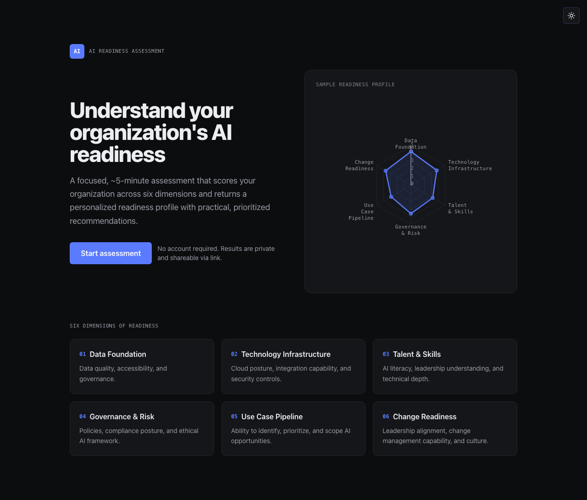

# AI Readiness Assessment

A focused, ~5-minute web app that scores your organization's AI readiness across
six dimensions, shows you a clear readiness profile, and hands you practical,
prioritized recommendations. No account, no signup, no database — your answers
live only in the URL, so results are private and easy to share.



## What it does

You answer a short set of multiple-choice questions. The app then:

- **Scores six dimensions** of readiness and plots them on a radar chart so you
  can see your shape at a glance — where you're strong, where you're thin.
- **Places you in a readiness tier** with an overall score, so the result is easy
  to talk about with leadership.
- **Highlights your biggest gaps** and generates personalized, prioritized
  recommendations (powered by Claude) — concrete next steps, not platitudes.
- **Gives you a shareable link.** Everything needed to reproduce your results is
  encoded in the URL, so you can send it to a colleague and they see exactly what
  you saw. No login, nothing stored on a server.

### The six dimensions

1. **Data Foundation** — Data quality, accessibility, and governance
2. **Technology Infrastructure** — Cloud posture, integration, security controls
3. **Talent & Skills** — AI literacy, leadership understanding, technical depth
4. **Governance & Risk** — Policies, compliance posture, ethical AI framework
5. **Use Case Pipeline** — Identifying, prioritizing, and scoping AI opportunities
6. **Change Readiness** — Leadership alignment, change management, culture

## What you get out of it

- A **shared vocabulary** for AI readiness across your team — six dimensions
  everyone can point at.
- An **honest snapshot** of where you actually are, instead of a vague feeling
  that you're "behind" or "ahead."
- A **prioritized starting point.** The recommendations focus on your lowest
  dimensions first, so you know what to fix before you fix it.
- Something **shareable in 5 minutes** that you can bring to a planning
  conversation, a board update, or a kickoff.

## Why I built it

After years of working alongside large enterprises on
their technology and AI efforts, I kept seeing the same pattern: teams wanted to
"do AI," but had no shared, honest way to talk about whether they were actually
ready. Conversations stalled on vibes. Budgets got committed before the
foundations existed. The same blind spots, like data, governance, and change management, showed up again and again.

So I built the assessment I wished those teams had on day one: a quick, structured
way to get a real picture, in plain language, that anyone in the organization can
take and share. It's deliberately lightweight because
the point is to start a better conversation, fast.

**The questions are based on real-world experience working with large
enterprise customers.** They reflect the patterns, gaps, and failure modes I've seen
firsthand inside big organizations, not a generic checklist.

## Want to run it locally?

Feel free to clone the repo or download the source as a .zip file and run it locally.

### Getting started

```bash
npm install
cp .env.example .env.local   # then add your real key
npm run dev
```

Open http://localhost:3000.

### Environment

Create `.env.local` with:

```
ANTHROPIC_API_KEY=your_key_here
```

The `/api/recommend` route returns a clear error if the key is missing, so the
rest of the app (scoring, radar chart, dimension cards, share link) works without
it.

### Rate limiting (optional)

`/api/recommend` supports IP-based rate limiting (5 assessments per IP per day)
via [Upstash Redis](https://upstash.com). Add the following to `.env.local`:

```
UPSTASH_REDIS_REST_URL=...
UPSTASH_REDIS_REST_TOKEN=...
```

If these are omitted, rate limiting is silently disabled — handy for local
development. When the limit is exceeded the route responds with `429` and a
`Retry-After` header.

## Scripts

| Command | Description |
| --- | --- |
| `npm run dev` | Start the dev server |
| `npm run build` | Production build |
| `npm run start` | Run the production build |
| `npm test` | Run unit tests (Vitest) for scoring + encoding |

## How it works

- **`data/questions.ts`** — typed question bank (5 labeled options per question).
- **`lib/scoring.ts`** — dimension averages, overall score, tier, and top gaps.
- **`lib/encoding.ts`** — URL-safe base64 encode/decode of the answer map.
- **`app/assessment`** — single-page, dimension-by-dimension flow with progress.
- **`app/results`** — decodes the URL, computes scores client-side, renders the
  radar chart and dimension cards, then calls `/api/recommend` for Claude advice.
- **`app/api/recommend/route.ts`** — builds a prompt from scores/tier/gaps and
  asks Claude (`claude-sonnet-4-6`) to return structured JSON recommendations.

Because results are recomputed purely from the URL, opening a results link in a
new tab always reproduces the same page — nothing is stored server-side.

## Tech stack

- **Next.js** (App Router) + **TypeScript**
- **Tailwind CSS** for styling
- **Recharts** for the radar chart
- **@anthropic-ai/sdk** for personalized recommendations
- No database — answers are encoded into the results URL (`?r=<base64>`)

## Tests

```bash
npm test
```

Covers dimension averaging/rounding, overall score, tier thresholds, top-gap
selection, and the encoding round-trip (including URL-safety and invalid input).
